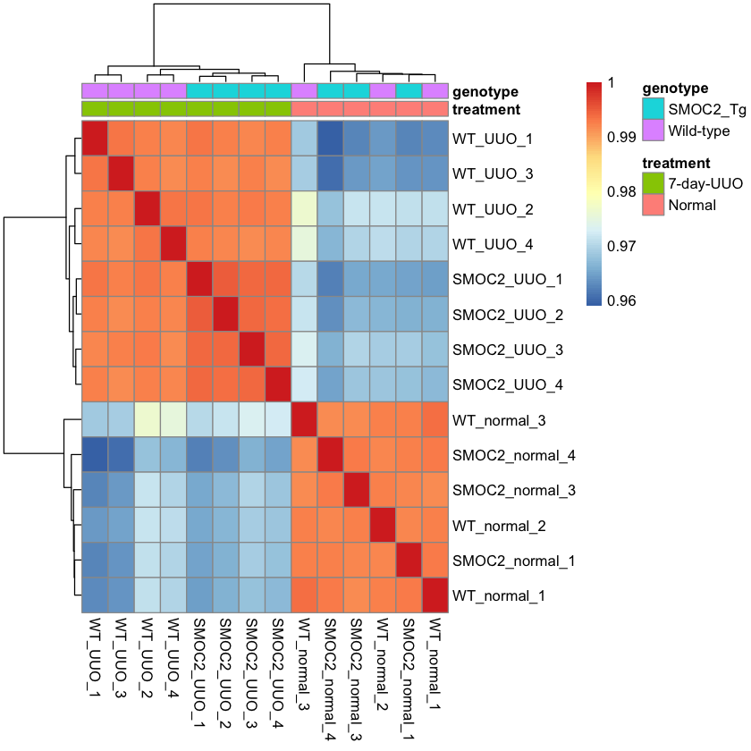
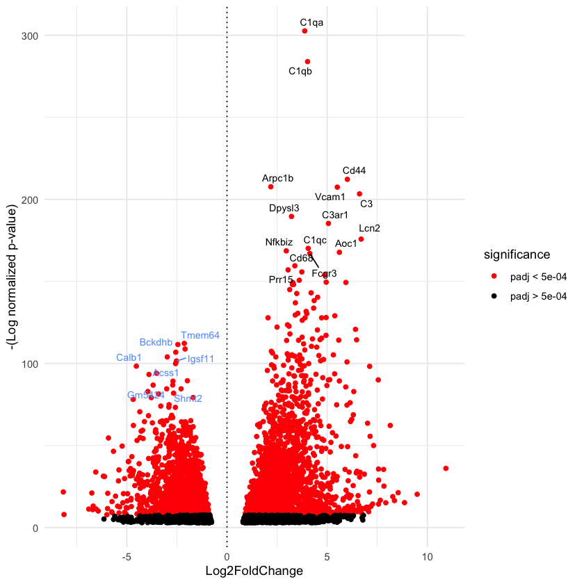
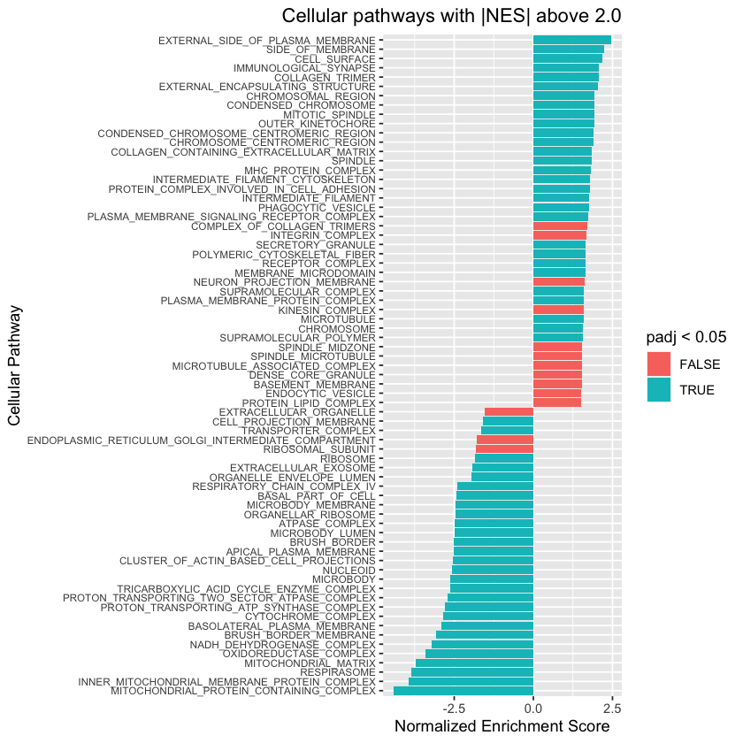

# Introduction Bulk mRNA Analysis 


I conducted a different gene expression analysis on data obtained from the study 
Gerarduzzi, Casimiro, et al., "Silencing SMOC2 ameliorates kidney fibrosis by inhibiting fibroblast 
to myofibroblast transformation." JCI insight 2, no. 8 (2017).
The gene expression data from this study can be obtained from https://www.ncbi.nlm.nih.gov/geo/query/acc.cgi?acc=GSE85209

Brief Introduction about this study:
In previous study authors reported that the SMOC2 upregulates in Kidney Fibrosis
Here they want to establish it's role by overexpressing SMOC2 in transgenic mice (SMOC2 Tg) and comparing it with the wild type having kidney fibrosis. 

The main goal of mRNA sequencing in this study is to identify differentially expressed pathways
between SMOC2 Tg versus Wild type mice following kidney fibrosis. However, the study does not have any code with the paper. This can be an exiciting task to reproduce everything from the scratch

SMOC2 which is Secreted Modular Calcium Binding Protein 2 known to play a role in fibrobalst to myofibroblast transition (FMT). The study proposes that SMOC2 inhibition could be therapuetic target to prevent kidney fibrosis.

Let's see if we can do a better job is enhancing the results


## Loading the wrangled data
Once data is downloaded from Gene Expression Omnibus. Please see wrangle.R in github repository


```R
df <- read.csv("resulting_data.csv", row.names="FirstColumn")
```


```R
#Get the colnames from the dataframe and remove the .rawcounts

col_names <- colnames(df)

new_col_names <- gsub("\\.rawcounts$", "", col_names)

colnames(df) <- new_col_names

head(df)
```


<table class="dataframe">
<caption>A data.frame: 6 × 14</caption>
<thead>
	<tr><th></th><th scope=col>SMOC2_normal_1</th><th scope=col>SMOC2_normal_3</th><th scope=col>SMOC2_normal_4</th><th scope=col>SMOC2_UUO_1</th><th scope=col>SMOC2_UUO_2</th><th scope=col>SMOC2_UUO_3</th><th scope=col>SMOC2_UUO_4</th><th scope=col>WT_normal_1</th><th scope=col>WT_normal_2</th><th scope=col>WT_normal_3</th><th scope=col>WT_UUO_1</th><th scope=col>WT_UUO_2</th><th scope=col>WT_UUO_3</th><th scope=col>WT_UUO_4</th></tr>
	<tr><th></th><th scope=col>&lt;int&gt;</th><th scope=col>&lt;int&gt;</th><th scope=col>&lt;int&gt;</th><th scope=col>&lt;int&gt;</th><th scope=col>&lt;int&gt;</th><th scope=col>&lt;int&gt;</th><th scope=col>&lt;int&gt;</th><th scope=col>&lt;int&gt;</th><th scope=col>&lt;int&gt;</th><th scope=col>&lt;int&gt;</th><th scope=col>&lt;int&gt;</th><th scope=col>&lt;int&gt;</th><th scope=col>&lt;int&gt;</th><th scope=col>&lt;int&gt;</th></tr>
</thead>
<tbody>
	<tr><th scope=row>ENSMUSG00000000001</th><td>1959</td><td>1868</td><td>2226</td><td>4508</td><td>3627</td><td>3042</td><td>3137</td><td>2751</td><td>2254</td><td>3310</td><td>4190</td><td>3938</td><td>3568</td><td>3708</td></tr>
	<tr><th scope=row>ENSMUSG00000000003</th><td>   0</td><td>   0</td><td>   0</td><td>   0</td><td>   0</td><td>   0</td><td>   0</td><td>   0</td><td>   0</td><td>   0</td><td>   0</td><td>   0</td><td>   0</td><td>   0</td></tr>
	<tr><th scope=row>ENSMUSG00000000028</th><td>  31</td><td>  44</td><td>  45</td><td> 163</td><td> 160</td><td> 171</td><td> 147</td><td>  36</td><td>  48</td><td>  71</td><td> 154</td><td> 128</td><td> 162</td><td> 118</td></tr>
	<tr><th scope=row>ENSMUSG00000000031</th><td>   1</td><td>   3</td><td>   1</td><td> 634</td><td> 174</td><td>  48</td><td>  20</td><td>   2</td><td>   4</td><td>   6</td><td> 521</td><td>   9</td><td>  22</td><td>   5</td></tr>
	<tr><th scope=row>ENSMUSG00000000037</th><td>   5</td><td>   7</td><td>   9</td><td>  21</td><td>  28</td><td>  29</td><td>  22</td><td>  11</td><td>  12</td><td>  13</td><td>  48</td><td>  32</td><td>  35</td><td>  33</td></tr>
	<tr><th scope=row>ENSMUSG00000000049</th><td>   0</td><td>   1</td><td>   1</td><td>   5</td><td>   6</td><td>   3</td><td>  14</td><td>   6</td><td>   0</td><td>   0</td><td>   6</td><td>   5</td><td>   3</td><td>   6</td></tr>
</tbody>
</table>


## Installation of annotables for Gene Annotation
```R
install.packages("remotes")  
remotes::install_github("r-lib/devtools") 

remotes::install_github("stephenturner/annotables")

````


```R
#Check if annotables is installed correctly
library("annotables")
```

## Generating metadata based on the experimental information from the paper


```R
#The Biological replicates
genotype <- c(rep("SMOC2_Tg", 3), rep("SMOC2_Tg", 4), rep("Wild-type", 3), rep("Wild-type", 4) )
treatment <- c(rep("Normal", 3), rep("7-day-UUO", 4), rep("Normal", 3), rep("7-day-UUO", 4))
```


```R
condition_metadata <- as.data.frame(cbind(genotype, treatment))

rownames(condition_metadata) <- colnames(df)

condition_metadata
```


<table class="dataframe">
<caption>A data.frame: 14 × 2</caption>
<thead>
	<tr><th></th><th scope=col>genotype</th><th scope=col>treatment</th></tr>
	<tr><th></th><th scope=col>&lt;chr&gt;</th><th scope=col>&lt;chr&gt;</th></tr>
</thead>
<tbody>
	<tr><th scope=row>SMOC2_normal_1</th><td>SMOC2_Tg </td><td>Normal   </td></tr>
	<tr><th scope=row>SMOC2_normal_3</th><td>SMOC2_Tg </td><td>Normal   </td></tr>
	<tr><th scope=row>SMOC2_normal_4</th><td>SMOC2_Tg </td><td>Normal   </td></tr>
	<tr><th scope=row>SMOC2_UUO_1</th><td>SMOC2_Tg </td><td>7-day-UUO</td></tr>
	<tr><th scope=row>SMOC2_UUO_2</th><td>SMOC2_Tg </td><td>7-day-UUO</td></tr>
	<tr><th scope=row>SMOC2_UUO_3</th><td>SMOC2_Tg </td><td>7-day-UUO</td></tr>
	<tr><th scope=row>SMOC2_UUO_4</th><td>SMOC2_Tg </td><td>7-day-UUO</td></tr>
	<tr><th scope=row>WT_normal_1</th><td>Wild-type</td><td>Normal   </td></tr>
	<tr><th scope=row>WT_normal_2</th><td>Wild-type</td><td>Normal   </td></tr>
	<tr><th scope=row>WT_normal_3</th><td>Wild-type</td><td>Normal   </td></tr>
	<tr><th scope=row>WT_UUO_1</th><td>Wild-type</td><td>7-day-UUO</td></tr>
	<tr><th scope=row>WT_UUO_2</th><td>Wild-type</td><td>7-day-UUO</td></tr>
	<tr><th scope=row>WT_UUO_3</th><td>Wild-type</td><td>7-day-UUO</td></tr>
	<tr><th scope=row>WT_UUO_4</th><td>Wild-type</td><td>7-day-UUO</td></tr>
</tbody>
</table>


## Running Deseq2 for analyzing differential gene expression between conditions

Overall, size factors in DESeq2 play a crucial role in normalizing RNA-seq data, ensuring that differences in gene expression are due to biological factors rather than technical artifacts introduced by differences in sequencing depth between samples.


```R
#Creating a DESeq2 object
library("DESeq2")
citation("DESeq2")
library("tidyverse")
```


    
    To cite package ‘DESeq2’ in publications use:
    
      Love, M.I., Huber, W., Anders, S. Moderated estimation of fold change
      and dispersion for RNA-seq data with DESeq2 Genome Biology 15(12):550
      (2014)
    
    A BibTeX entry for LaTeX users is
    
      @Article{,
        title = {Moderated estimation of fold change and dispersion for RNA-seq data with DESeq2},
        author = {Michael I. Love and Wolfgang Huber and Simon Anders},
        year = {2014},
        journal = {Genome Biology},
        doi = {10.1186/s13059-014-0550-8},
        volume = {15},
        issue = {12},
        pages = {550},
      }


```R
dds <- DESeqDataSetFromMatrix(countData =df, colData = condition_metadata, design = ~genotype+treatment+genotype:treatment)
```

    Warning message in DESeqDataSet(se, design = design, ignoreRank):
    “some variables in design formula are characters, converting to factors”
      Note: levels of factors in the design contain characters other than
      letters, numbers, '_' and '.'. It is recommended (but not required) to use
      only letters, numbers, and delimiters '_' or '.', as these are safe characters
      for column names in R. [This is a message, not a warning or an error]
    


```R
dds <- DESeq(dds)
```

    estimating size factors
    
      Note: levels of factors in the design contain characters other than
      letters, numbers, '_' and '.'. It is recommended (but not required) to use
      only letters, numbers, and delimiters '_' or '.', as these are safe characters
      for column names in R. [This is a message, not a warning or an error]
    
    estimating dispersions
    
    gene-wise dispersion estimates
    
    mean-dispersion relationship
    
      Note: levels of factors in the design contain characters other than
      letters, numbers, '_' and '.'. It is recommended (but not required) to use
      only letters, numbers, and delimiters '_' or '.', as these are safe characters
      for column names in R. [This is a message, not a warning or an error]
    
    final dispersion estimates
    
      Note: levels of factors in the design contain characters other than
      letters, numbers, '_' and '.'. It is recommended (but not required) to use
      only letters, numbers, and delimiters '_' or '.', as these are safe characters
      for column names in R. [This is a message, not a warning or an error]
    
    fitting model and testing
    


```R
sizeFactors(dds)
normalized_counts <- counts(dds, normalized= T)


```


<style>
.dl-inline {width: auto; margin:0; padding: 0}
.dl-inline>dt, .dl-inline>dd {float: none; width: auto; display: inline-block}
.dl-inline>dt::after {content: ":\0020"; padding-right: .5ex}
.dl-inline>dt:not(:first-of-type) {padding-left: .5ex}
</style><dl class=dl-inline><dt>SMOC2_normal_1</dt><dd>0.677565675288269</dd><dt>SMOC2_normal_3</dt><dd>0.764527535589961</dd><dt>SMOC2_normal_4</dt><dd>0.812904501953792</dd><dt>SMOC2_UUO_1</dt><dd>1.36663470845501</dd><dt>SMOC2_UUO_2</dt><dd>1.06814326584492</dd><dt>SMOC2_UUO_3</dt><dd>1.19880216324493</dd><dt>SMOC2_UUO_4</dt><dd>1.03264298202517</dd><dt>WT_normal_1</dt><dd>0.958842425803838</dd><dt>WT_normal_2</dt><dd>0.762169004924036</dd><dt>WT_normal_3</dt><dd>1.09976012053563</dd><dt>WT_UUO_1</dt><dd>1.1853657369948</dd><dt>WT_UUO_2</dt><dd>1.2608874662419</dd><dt>WT_UUO_3</dt><dd>1.22364493045151</dd><dt>WT_UUO_4</dt><dd>0.983265101859574</dd></dl>


## Heatmap visualization of samples

Treatment Unilateral Ureteral Obstruction has a major effect on the transcriptome profile than the genotype


```R
#Transform the normalized counts
vsd_smoc2 <- vst(dds, blind =TRUE)
#Extract the matrix of the normalized counts
vsd_mat_smoc2 <- assay(vsd_smoc2)
#Compute the correlation values between samples
vsd_cor_smoc2 <- cor(vsd_mat_smoc2)
#Plot the heatmap
pheatmap::pheatmap(vsd_cor_smoc2, annotation = select(condition_metadata, c(treatment, genotype)))
```


    

    


## Volcano plot for showing upregulation and downregulation of genes following the treatment


```R
dds_res <- results(dds, contrast = c("treatment", "7-day-UUO", "Normal"), alpha =0.05, lfcThreshold=0.58)
library("annotables")
dds_res_all <- data.frame(dds_res)
dds_with_id <- rownames_to_column(as.data.frame(dds_res_all), var = "ensgene")
annotated_dds <- right_join(grcm38[, c("ensgene", "symbol", "description", "biotype")], dds_with_id, by = "ensgene")
#Significant_genes
annotated_dds_sig <- subset(annotated_dds, padj <0.05)
annotated_dds_sig <- annotated_dds_sig %>% arrange(padj)
head(annotated_dds_sig)
```


<table class="dataframe">
<caption>A tibble: 6 × 10</caption>
<thead>
	<tr><th scope=col>ensgene</th><th scope=col>symbol</th><th scope=col>description</th><th scope=col>biotype</th><th scope=col>baseMean</th><th scope=col>log2FoldChange</th><th scope=col>lfcSE</th><th scope=col>stat</th><th scope=col>pvalue</th><th scope=col>padj</th></tr>
	<tr><th scope=col>&lt;chr&gt;</th><th scope=col>&lt;chr&gt;</th><th scope=col>&lt;chr&gt;</th><th scope=col>&lt;chr&gt;</th><th scope=col>&lt;dbl&gt;</th><th scope=col>&lt;dbl&gt;</th><th scope=col>&lt;dbl&gt;</th><th scope=col>&lt;dbl&gt;</th><th scope=col>&lt;dbl&gt;</th><th scope=col>&lt;dbl&gt;</th></tr>
</thead>
<tbody>
	<tr><td>ENSMUSG00000036887</td><td>C1qa  </td><td>complement component 1, q subcomponent, alpha polypeptide</td><td>protein_coding</td><td> 3770.020</td><td>3.878967</td><td>0.13265040</td><td>24.86964</td><td>1.585893e-136</td><td>3.582691e-132</td></tr>
	<tr><td>ENSMUSG00000036905</td><td>C1qb  </td><td>complement component 1, q subcomponent, beta polypeptide </td><td>protein_coding</td><td> 3157.198</td><td>4.020208</td><td>0.14287461</td><td>24.07851</td><td>4.198453e-128</td><td>4.742363e-124</td></tr>
	<tr><td>ENSMUSG00000005087</td><td>Cd44  </td><td>CD44 antigen                                             </td><td>protein_coding</td><td> 2467.155</td><td>6.005383</td><td>0.25988943</td><td>20.87574</td><td> 8.898519e-97</td><td> 6.700881e-93</td></tr>
	<tr><td>ENSMUSG00000029622</td><td>Arpc1b</td><td>actin related protein 2/3 complex, subunit 1B            </td><td>protein_coding</td><td> 3616.330</td><td>2.185548</td><td>0.07777596</td><td>20.64325</td><td> 1.122628e-94</td><td> 6.340324e-91</td></tr>
	<tr><td>ENSMUSG00000027962</td><td>Vcam1 </td><td>vascular cell adhesion molecule 1                        </td><td>protein_coding</td><td> 8676.758</td><td>5.503562</td><td>0.23875893</td><td>20.62148</td><td> 1.761023e-94</td><td> 7.956653e-91</td></tr>
	<tr><td>ENSMUSG00000024164</td><td>C3    </td><td>complement component 3                                   </td><td>protein_coding</td><td>32230.352</td><td>6.611173</td><td>0.29545504</td><td>20.41317</td><td> 1.277307e-92</td><td> 4.809275e-89</td></tr>
</tbody>
</table>


```R
plot_volcano <- function (res, padj_cutoff, nlabel = 15, label.by = "padj"){
  # assign significance to results based on padj
  res <- mutate(res, significance=ifelse(res$padj<padj_cutoff, paste0("padj < ", padj_cutoff), paste0("padj > ", padj_cutoff)))
  res = res[!is.na(res$significance),]
  significant_genes <- res %>% filter(significance == paste0("padj < ", padj_cutoff))
  
  # get labels for the highest or lowest genes according to either padj or log2FoldChange
  if (label.by == "padj") {
    top_genes <- significant_genes %>% arrange(padj) %>% head(nlabel)
    bottom_genes <- significant_genes %>% filter (log2FoldChange < 0) %>% arrange(padj) %>% head (nlabel)
  } else if (label.by == "log2FoldChange") {
    top_genes <- head(arrange(significant_genes, desc(log2FoldChange)),nlabel)
    bottom_genes <- head(arrange(significant_genes, log2FoldChange),nlabel)
  } else
    stop ("Invalid label.by argument. Choose either padj or log2FoldChange.")
  
  ggplot(res, aes(log2FoldChange, -log(padj))) +
    geom_point(aes(col=significance)) + 
    scale_color_manual(values=c("red", "black")) + 
    ggrepel::geom_text_repel(data=top_genes, aes(label=head(symbol,nlabel)), size = 3)+
    ggrepel::geom_text_repel(data=bottom_genes, aes(label=head(symbol,nlabel)), color = "#619CFF", size = 3)+
    labs ( x = "Log2FoldChange", y = "-(Log normalized p-value)")+
    geom_vline(xintercept = 0, linetype = "dotted")+
    theme_minimal()
  
}

plot_volcano(annotated_dds_sig, 0.0005, nlabel = 15, label.by = "padj")

```

    Warning message:
    “ggrepel: 8 unlabeled data points (too many overlaps). Consider increasing max.overlaps”


    

    


```R

```


```R
#install_github("ctlab/fgsea")

# make ordered rank file for GSEA, selecting only protein coding genes
  res_prot <- annotated_dds_sig[which(annotated_dds_sig$biotype == "protein_coding"),]
  res_prot_ranked <- res_prot[order(res_prot$log2FoldChange, decreasing = T),c("symbol", "log2FoldChange")]
  res_prot_ranked <- na.omit(res_prot_ranked)
#This step is not needed
  #res_prot_ranked$symbol <- str_to_upper(res_prot_ranked$symbol)

res_prot_ranked

library(fgsea)
# read in file containing lists of genes for each pathway
cellular_pathway <- gmtPathways("m5.go.cc.v2023.2.Mm.symbols.gmt")
```


<table class="dataframe">
<caption>A tibble: 4650 × 2</caption>
<thead>
	<tr><th scope=col>symbol</th><th scope=col>log2FoldChange</th></tr>
	<tr><th scope=col>&lt;chr&gt;</th><th scope=col>&lt;dbl&gt;</th></tr>
</thead>
<tbody>
	<tr><td>Il36a   </td><td>10.920749</td></tr>
	<tr><td>Sprr2f  </td><td> 9.487909</td></tr>
	<tr><td>Fgb     </td><td> 8.858975</td></tr>
	<tr><td>Ccl7    </td><td> 8.541317</td></tr>
	<tr><td>Saa1    </td><td> 8.353612</td></tr>
	<tr><td>Defb36  </td><td> 8.271003</td></tr>
	<tr><td>Arhgap36</td><td> 8.144915</td></tr>
	<tr><td>Mmp8    </td><td> 7.924143</td></tr>
	<tr><td>Vgf     </td><td> 7.830749</td></tr>
	<tr><td>Cd300lf </td><td> 7.813547</td></tr>
	<tr><td>Cdh17   </td><td> 7.650347</td></tr>
	<tr><td>Ccl12   </td><td> 7.567384</td></tr>
	<tr><td>Asphd2  </td><td> 7.560705</td></tr>
	<tr><td>Mmp3    </td><td> 7.557183</td></tr>
	<tr><td>Timp1   </td><td> 7.546899</td></tr>
	<tr><td>Il1rn   </td><td> 7.312406</td></tr>
	<tr><td>Lrrn2   </td><td> 7.265993</td></tr>
	<tr><td>Ccl24   </td><td> 7.182869</td></tr>
	<tr><td>Ltbp2   </td><td> 7.139251</td></tr>
	<tr><td>Sorcs1  </td><td> 7.116866</td></tr>
	<tr><td>Ccl22   </td><td> 7.107347</td></tr>
	<tr><td>Krt14   </td><td> 7.101176</td></tr>
	<tr><td>Serpinb5</td><td> 7.070024</td></tr>
	<tr><td>Tmem59l </td><td> 7.038456</td></tr>
	<tr><td>Fut1    </td><td> 7.035686</td></tr>
	<tr><td>Crlf1   </td><td> 7.014572</td></tr>
	<tr><td>Mmp10   </td><td> 6.994065</td></tr>
	<tr><td>Ms4a4a  </td><td> 6.965846</td></tr>
	<tr><td>Cxcl2   </td><td> 6.852872</td></tr>
	<tr><td>Ccdc190 </td><td> 6.828530</td></tr>
	<tr><td>⋮</td><td>⋮</td></tr>
	<tr><td>Ins2      </td><td>-4.870855</td></tr>
	<tr><td>Ugt3a1    </td><td>-4.907870</td></tr>
	<tr><td>Slc22a8   </td><td>-4.926190</td></tr>
	<tr><td>Samd7     </td><td>-4.949853</td></tr>
	<tr><td>Ces1d     </td><td>-4.961348</td></tr>
	<tr><td>Mt3       </td><td>-4.969806</td></tr>
	<tr><td>Epo       </td><td>-4.971884</td></tr>
	<tr><td>Fam47e    </td><td>-5.031410</td></tr>
	<tr><td>Nccrp1    </td><td>-5.038911</td></tr>
	<tr><td>Egf       </td><td>-5.112145</td></tr>
	<tr><td>Mfrp      </td><td>-5.166100</td></tr>
	<tr><td>Shbg      </td><td>-5.166678</td></tr>
	<tr><td>Car5a     </td><td>-5.231427</td></tr>
	<tr><td>Cyp2c69   </td><td>-5.389362</td></tr>
	<tr><td>Tex21     </td><td>-5.436102</td></tr>
	<tr><td>Hsd3b5    </td><td>-5.457404</td></tr>
	<tr><td>Cyp2d12   </td><td>-5.665011</td></tr>
	<tr><td>Kcnt1     </td><td>-5.915309</td></tr>
	<tr><td>Kcna1     </td><td>-5.961125</td></tr>
	<tr><td>Fbxw24    </td><td>-5.992266</td></tr>
	<tr><td>Hpd       </td><td>-6.110861</td></tr>
	<tr><td>Ces1b     </td><td>-6.427484</td></tr>
	<tr><td>Hrg       </td><td>-6.529580</td></tr>
	<tr><td>Pvalb     </td><td>-6.549282</td></tr>
	<tr><td>Odf4      </td><td>-6.677758</td></tr>
	<tr><td>Cldn18    </td><td>-6.702259</td></tr>
	<tr><td>Bhmt      </td><td>-6.745440</td></tr>
	<tr><td>Rph3a     </td><td>-6.898500</td></tr>
	<tr><td>Sycn      </td><td>-8.133899</td></tr>
	<tr><td>AAdacl4fm3</td><td>-8.168439</td></tr>
</tbody>
</table>


```R
# formats the ranked list for the fgsea() function
prepare_ranked_list <- function(ranked_list) { 
  # if duplicate gene names present, average the values
  if( sum(duplicated(ranked_list$symbol)) > 0) {
    ranked_list <- aggregate(.~symbol, FUN = mean, data = ranked_list)
    ranked_list <- ranked_list[order(ranked_list$log2FoldChange, decreasing = T),]
  }
  # omit rows with NA values
  ranked_list <- na.omit(ranked_list)
  # turn the dataframe into a named vector
  ranked_list <- tibble::deframe(ranked_list)
  ranked_list
}


```


```R
UUO_normal_list <- prepare_ranked_list(res_prot_ranked)
head(UUO_normal_list)
head(res_prot_ranked)
```


<style>
.dl-inline {width: auto; margin:0; padding: 0}
.dl-inline>dt, .dl-inline>dd {float: none; width: auto; display: inline-block}
.dl-inline>dt::after {content: ":\0020"; padding-right: .5ex}
.dl-inline>dt:not(:first-of-type) {padding-left: .5ex}
</style><dl class=dl-inline><dt>Il36a</dt><dd>10.9207492790465</dd><dt>Sprr2f</dt><dd>9.48790946747305</dd><dt>Fgb</dt><dd>8.8589754403541</dd><dt>Ccl7</dt><dd>8.54131669503726</dd><dt>Saa1</dt><dd>8.35361201799293</dd><dt>Defb36</dt><dd>8.27100304912329</dd></dl>


<table class="dataframe">
<caption>A tibble: 6 × 2</caption>
<thead>
	<tr><th scope=col>symbol</th><th scope=col>log2FoldChange</th></tr>
	<tr><th scope=col>&lt;chr&gt;</th><th scope=col>&lt;dbl&gt;</th></tr>
</thead>
<tbody>
	<tr><td>Il36a </td><td>10.920749</td></tr>
	<tr><td>Sprr2f</td><td> 9.487909</td></tr>
	<tr><td>Fgb   </td><td> 8.858975</td></tr>
	<tr><td>Ccl7  </td><td> 8.541317</td></tr>
	<tr><td>Saa1  </td><td> 8.353612</td></tr>
	<tr><td>Defb36</td><td> 8.271003</td></tr>
</tbody>
</table>


```R
# generate GSEA results table using fgsea() by inputting the pathway list and ranked list
fgsea_results <- fgsea(pathways = cellular_pathway,
                  stats = UUO_normal_list,
                  minSize = 15,
                  maxSize = 500)

fgsea_results %>% arrange (desc(NES)) %>% select (pathway, padj, NES) %>% na.omit()
```

    Warning message in fgseaMultilevel(pathways = pathways, stats = stats, minSize = minSize, :
    “There were 7 pathways for which P-values were not calculated properly due to unbalanced (positive and negative) gene-level statistic values. For such pathways pval, padj, NES, log2err are set to NA. You can try to increase the value of the argument nPermSimple (for example set it nPermSimple = 10000)”


<table class="dataframe">
<caption>A data.table: 243 × 3</caption>
<thead>
	<tr><th scope=col>pathway</th><th scope=col>padj</th><th scope=col>NES</th></tr>
	<tr><th scope=col>&lt;chr&gt;</th><th scope=col>&lt;dbl&gt;</th><th scope=col>&lt;dbl&gt;</th></tr>
</thead>
<tbody>
	<tr><td>GOCC_EXTERNAL_SIDE_OF_PLASMA_MEMBRANE          </td><td>2.309677e-16</td><td>2.455041</td></tr>
	<tr><td>GOCC_SIDE_OF_MEMBRANE                          </td><td>6.637727e-16</td><td>2.244699</td></tr>
	<tr><td>GOCC_CELL_SURFACE                              </td><td>5.007862e-17</td><td>2.182633</td></tr>
	<tr><td>GOCC_IMMUNOLOGICAL_SYNAPSE                     </td><td>3.097818e-03</td><td>2.067149</td></tr>
	<tr><td>GOCC_COLLAGEN_TRIMER                           </td><td>1.251529e-03</td><td>2.061737</td></tr>
	<tr><td>GOCC_EXTERNAL_ENCAPSULATING_STRUCTURE          </td><td>7.694507e-08</td><td>2.049587</td></tr>
	<tr><td>GOCC_CHROMOSOMAL_REGION                        </td><td>6.154636e-04</td><td>1.939872</td></tr>
	<tr><td>GOCC_CONDENSED_CHROMOSOME                      </td><td>1.150210e-03</td><td>1.932586</td></tr>
	<tr><td>GOCC_MITOTIC_SPINDLE                           </td><td>1.316881e-03</td><td>1.926431</td></tr>
	<tr><td>GOCC_OUTER_KINETOCHORE                         </td><td>1.718312e-02</td><td>1.920049</td></tr>
	<tr><td>GOCC_CONDENSED_CHROMOSOME_CENTROMERIC_REGION   </td><td>4.625552e-03</td><td>1.895540</td></tr>
	<tr><td>GOCC_CHROMOSOME_CENTROMERIC_REGION             </td><td>2.471936e-03</td><td>1.891378</td></tr>
	<tr><td>GOCC_COLLAGEN_CONTAINING_EXTRACELLULAR_MATRIX  </td><td>9.521294e-05</td><td>1.854763</td></tr>
	<tr><td>GOCC_SPINDLE                                   </td><td>2.169008e-03</td><td>1.839093</td></tr>
	<tr><td>GOCC_MHC_PROTEIN_COMPLEX                       </td><td>3.021336e-02</td><td>1.821499</td></tr>
	<tr><td>GOCC_INTERMEDIATE_FILAMENT_CYTOSKELETON        </td><td>1.405148e-02</td><td>1.801544</td></tr>
	<tr><td>GOCC_PROTEIN_COMPLEX_INVOLVED_IN_CELL_ADHESION </td><td>3.020667e-02</td><td>1.792209</td></tr>
	<tr><td>GOCC_INTERMEDIATE_FILAMENT                     </td><td>4.082812e-02</td><td>1.767404</td></tr>
	<tr><td>GOCC_PHAGOCYTIC_VESICLE                        </td><td>2.405975e-02</td><td>1.746982</td></tr>
	<tr><td>GOCC_PLASMA_MEMBRANE_SIGNALING_RECEPTOR_COMPLEX</td><td>7.417946e-03</td><td>1.746430</td></tr>
	<tr><td>GOCC_COMPLEX_OF_COLLAGEN_TRIMERS               </td><td>9.852052e-02</td><td>1.691082</td></tr>
	<tr><td>GOCC_INTEGRIN_COMPLEX                          </td><td>7.491152e-02</td><td>1.683361</td></tr>
	<tr><td>GOCC_SECRETORY_GRANULE                         </td><td>7.888777e-03</td><td>1.662753</td></tr>
	<tr><td>GOCC_POLYMERIC_CYTOSKELETAL_FIBER              </td><td>1.615487e-03</td><td>1.659973</td></tr>
	<tr><td>GOCC_RECEPTOR_COMPLEX                          </td><td>9.808050e-03</td><td>1.649987</td></tr>
	<tr><td>GOCC_MEMBRANE_MICRODOMAIN                      </td><td>1.087055e-02</td><td>1.642303</td></tr>
	<tr><td>GOCC_NEURON_PROJECTION_MEMBRANE                </td><td>1.329206e-01</td><td>1.615505</td></tr>
	<tr><td>GOCC_SUPRAMOLECULAR_COMPLEX                    </td><td>6.154636e-04</td><td>1.591506</td></tr>
	<tr><td>GOCC_PLASMA_MEMBRANE_PROTEIN_COMPLEX           </td><td>5.727564e-03</td><td>1.587817</td></tr>
	<tr><td>GOCC_KINESIN_COMPLEX                           </td><td>1.329206e-01</td><td>1.584400</td></tr>
	<tr><td>⋮</td><td>⋮</td><td>⋮</td></tr>
	<tr><td>GOCC_CELL_PROJECTION_MEMBRANE                            </td><td>3.305873e-02</td><td>-1.582679</td></tr>
	<tr><td>GOCC_TRANSPORTER_COMPLEX                                 </td><td>1.074373e-02</td><td>-1.637642</td></tr>
	<tr><td>GOCC_ENDOPLASMIC_RETICULUM_GOLGI_INTERMEDIATE_COMPARTMENT</td><td>7.491152e-02</td><td>-1.781797</td></tr>
	<tr><td>GOCC_RIBOSOMAL_SUBUNIT                                   </td><td>5.683233e-02</td><td>-1.828272</td></tr>
	<tr><td>GOCC_RIBOSOME                                            </td><td>1.994313e-02</td><td>-1.841353</td></tr>
	<tr><td>GOCC_EXTRACELLULAR_EXOSOME                               </td><td>8.869368e-03</td><td>-1.931819</td></tr>
	<tr><td>GOCC_ORGANELLE_ENVELOPE_LUMEN                            </td><td>1.243220e-02</td><td>-1.945588</td></tr>
	<tr><td>GOCC_RESPIRATORY_CHAIN_COMPLEX_IV                        </td><td>1.316881e-03</td><td>-2.415938</td></tr>
	<tr><td>GOCC_BASAL_PART_OF_CELL                                  </td><td>7.694507e-08</td><td>-2.435013</td></tr>
	<tr><td>GOCC_MICROBODY_MEMBRANE                                  </td><td>3.329859e-04</td><td>-2.464875</td></tr>
	<tr><td>GOCC_ORGANELLAR_RIBOSOME                                 </td><td>7.849539e-04</td><td>-2.471484</td></tr>
	<tr><td>GOCC_ATPASE_COMPLEX                                      </td><td>3.329859e-04</td><td>-2.480256</td></tr>
	<tr><td>GOCC_MICROBODY_LUMEN                                     </td><td>6.216988e-04</td><td>-2.491646</td></tr>
	<tr><td>GOCC_BRUSH_BORDER                                        </td><td>4.383892e-06</td><td>-2.503006</td></tr>
	<tr><td>GOCC_APICAL_PLASMA_MEMBRANE                              </td><td>3.035785e-10</td><td>-2.503629</td></tr>
	<tr><td>GOCC_CLUSTER_OF_ACTIN_BASED_CELL_PROJECTIONS             </td><td>5.081239e-07</td><td>-2.546012</td></tr>
	<tr><td>GOCC_NUCLEOID                                            </td><td>3.329859e-04</td><td>-2.560131</td></tr>
	<tr><td>GOCC_MICROBODY                                           </td><td>6.616279e-07</td><td>-2.616952</td></tr>
	<tr><td>GOCC_TRICARBOXYLIC_ACID_CYCLE_ENZYME_COMPLEX             </td><td>3.229502e-04</td><td>-2.637376</td></tr>
	<tr><td>GOCC_PROTON_TRANSPORTING_TWO_SECTOR_ATPASE_COMPLEX       </td><td>2.524530e-05</td><td>-2.718078</td></tr>
	<tr><td>GOCC_PROTON_TRANSPORTING_ATP_SYNTHASE_COMPLEX            </td><td>9.853434e-05</td><td>-2.781517</td></tr>
	<tr><td>GOCC_CYTOCHROME_COMPLEX                                  </td><td>5.734247e-06</td><td>-2.852773</td></tr>
	<tr><td>GOCC_BASOLATERAL_PLASMA_MEMBRANE                         </td><td>1.054998e-09</td><td>-2.894578</td></tr>
	<tr><td>GOCC_BRUSH_BORDER_MEMBRANE                               </td><td>5.176651e-09</td><td>-3.081988</td></tr>
	<tr><td>GOCC_NADH_DEHYDROGENASE_COMPLEX                          </td><td>2.921561e-09</td><td>-3.221713</td></tr>
	<tr><td>GOCC_OXIDOREDUCTASE_COMPLEX                              </td><td>4.459634e-14</td><td>-3.414984</td></tr>
	<tr><td>GOCC_MITOCHONDRIAL_MATRIX                                </td><td>6.930378e-19</td><td>-3.705495</td></tr>
	<tr><td>GOCC_RESPIRASOME                                         </td><td>3.813174e-16</td><td>-3.843034</td></tr>
	<tr><td>GOCC_INNER_MITOCHONDRIAL_MEMBRANE_PROTEIN_COMPLEX        </td><td>8.167966e-20</td><td>-3.934527</td></tr>
	<tr><td>GOCC_MITOCHONDRIAL_PROTEIN_CONTAINING_COMPLEX            </td><td>1.677230e-32</td><td>-4.401692</td></tr>
</tbody>
</table>


```R
library("ggplot2")
waterfall_plot <- function(fgsea_results, threshold, graph_title) {
  fgsea_results_filtered <- fgsea_results %>%
    filter(abs(NES) > threshold)  # Filter pathways where absolute NES is above threshold
  
  fgsea_results_filtered %>%
    mutate(short_name = str_split_fixed(pathway, "_", 2)[, 2]) %>% 
    ggplot(aes(reorder(short_name, NES), NES)) +
    geom_bar(stat = "identity", aes(fill = padj <0.05)) +  # Color bars based on significance
    coord_flip() +
    labs(x = "Cellular Pathway", y = "Normalized Enrichment Score", title = graph_title) +
    theme(axis.text.y = element_text(size = 7),
          plot.title = element_text(hjust = 1))
}

# Example usage: plot pathways with absolute NES above 2.0
waterfall_plot(fgsea_results, threshold = 1.5, graph_title = "Cellular pathways with |NES| above 2.0")


```


    

    


Conclusion: I see sigificant enrichment in extracellular matrix protein pathways in UUO treatment compared to normal.


```R

```


```R

```


```R

```


```R

```


```R

```


```R

```


```R

```


```R

```


```R

```


```R

```
